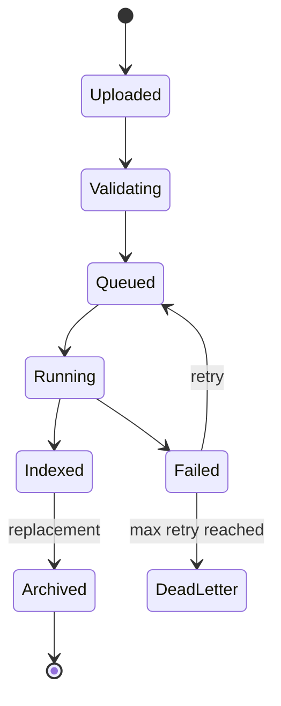
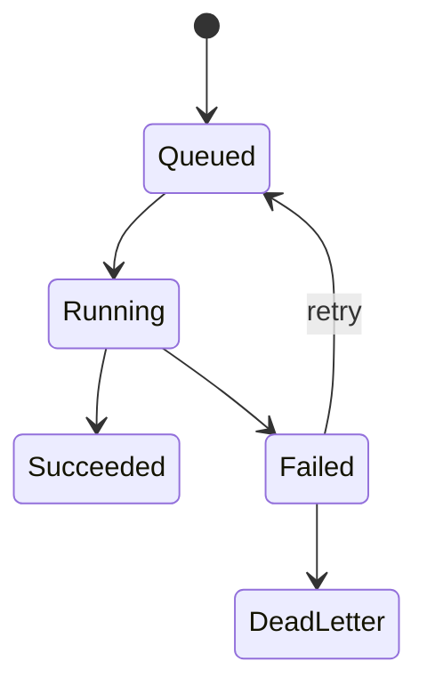
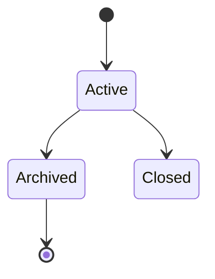

# State Machines

## Document processing state machine

```mermaid
stateDiagram-v2
    [*] --> Uploaded
    Uploaded --> Validating
    Validating --> Queued
    Queued --> Running
    Running --> Indexed
    Running --> Failed
    Failed --> Queued: retry
    Failed --> DeadLetter: max retry reached
    Indexed --> Archived: replacement
    Archived --> [*]
```

## Ingestion job state machine

```mermaid
stateDiagram-v2
    [*] --> Queued
    Queued --> Running
    Running --> Succeeded
    Running --> Failed
    Failed --> Queued: retry
    Failed --> DeadLetter
```

## Conversation state machine

```mermaid
stateDiagram-v2
    [*] --> Active
    Active --> Archived
    Active --> Closed
    Archived --> [*]
```
